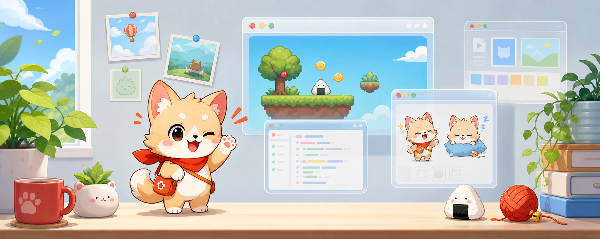

# 桌宠伙伴

[English](README.md) | [简体中文](README.zh-CN.md)



这是一个本地运行的 Godot 桌面宠物：透明窗口动画、物理互动、陪伴行为、小游戏、截图贴图，以及 Shimeji-ee 皮肤商店和辅助导入。

[阅读完整文档](docs/README.md)

## 有什么用

- 在桌面上显示一个置顶动画桌宠。
- 可以抱起、甩飞、重力落地，也可以拖到屏幕边缘偷看。
- 支持安静、活泼、捣乱三种行为模式；行为会参考时间段、饥饿、体力、心情、亲密度、最近互动和打扰冷却。
- 可以投喂、玩接球小游戏、查看本地状态。
- `F1` 区域截图，`F3` 把最近截图贴到桌面，`F4` 关闭当前贴图。
- 可以在皮肤商店里浏览 Shimeji 内容，打开原站下载页面，再导入 ZIP 或文件夹。

## 从源码运行

```bash
python3 scripts/setup_dev_environment.py
scripts/setup_godot.sh
python3 scripts/generate_godot_manifest.py
scripts/run_godot_pet.sh
```

如果当前桌面环境的透明窗口或鼠标穿透表现异常，先用安全窗口模式验收功能：

```bash
CRAYON_PET_SAFE_WINDOW=1 scripts/run_godot_pet.sh
```

## Linux 本地安装

构建本地 portable runtime bundle，并安装用户级桌面入口：

```bash
scripts/build_godot_linux.sh
scripts/install_desktop_entry.sh
```

桌面入口安装到：

```text
~/.local/share/applications/mascotmate-desktop.desktop
```

不需要系统级安装。你可以从应用启动器打开，也可以直接运行：

```bash
dist/MascotMateDesktop/MascotMateDesktop
```

## 基本操作

| 操作 | 效果 |
| --- | --- |
| 单击头部 | 摸摸头 |
| 单击身体 | 戳一戳 |
| 长按 350ms | 抱起 |
| 快速释放 | 甩飞 |
| 拖到屏幕边缘释放 | 进入贴边偷看 |
| 双击 | 开始接球小游戏 |
| 滚轮 | 显示心情、饥饿、体力、亲密度 |
| 右键 | 打开动作、皮肤、模式、截图设置和退出菜单 |

## 常用校验

```bash
python3 scripts/generate_godot_manifest.py --check
python3 scripts/validate_resources.py
python3 scripts/validate_skin_catalog.py --check
python3 scripts/run_godot_smoke.py
python3 -m unittest discover tests
```

## 文档

- [运行应用](docs/guide/run-app.md)
- [安装与打包](docs/guide/package-install.md)
- [架构总览](docs/architecture/README.md)
- [行为系统](docs/modules/behavior.md)
- [截图贴图](docs/modules/screenshot-pins.md)
- [皮肤包规范](docs/sdk/skin-package-spec.md)
- [皮肤商店 catalog](docs/sdk/skin-catalog.md)
- [Shimeji-ee 导入](docs/sdk/shimeji-import.md)
- [故障排查](docs/faq/troubleshooting.md)

## 许可与素材

代码使用 [MIT License](LICENSE)。仓库中的角色相关素材属于粉丝项目素材，请仅在学习、研究和个人本地桌面使用场景中使用；公开发行前请替换为原创或已授权素材。
