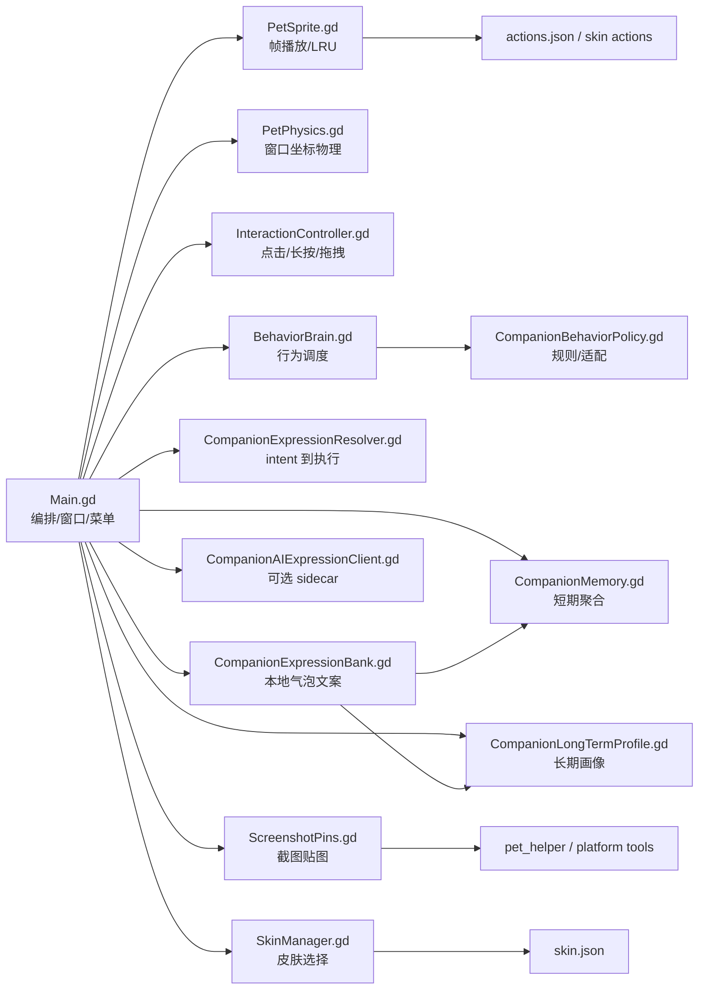

# MascotMate Desktop 开发者文档

> 这套文档面向维护者和贡献者，说明当前代码库的真实运行方式、模块边界、资源管线、配置文件和发布流程。用户上手请先看仓库根目录的 [README](../README.zh-CN.md)。


## 项目定位

MascotMate Desktop 是一个 Godot 4 桌面宠物运行时。Godot 负责透明窗口、动画渲染、输入、物理、行为调度、截图贴图和本地状态；Python/Bash 负责 Godot runtime 准备、资源清单生成、Shimeji-ee 导入、皮肤商店服务、跨平台 helper 和打包。

项目当前的功能边界：

- 桌宠窗口：透明、置顶、无边框，可按可见区域配置鼠标穿透。
- 用户互动：摸头、戳身体、抱起、轻放、甩飞、贴边偷看、双击逗一逗、滚轮状态查看。
- 右键菜单：动作、投喂、睡眠、显示大小、重力、皮肤商店、陪伴控制台、截图设置、行为模式、文案语气、清理和退出。
- 陪伴行为：安静、活泼、捣乱三种模式，结合状态、时间段、互动记忆和长期画像做低打扰决策。
- 表达系统：本地表达库按 key、tone、关系等级、偏好互动、最近文案选择气泡；可选 AI sidecar 只允许生成气泡文本。
- 截图贴图：`F1` 区域截图，`F3` 贴出或轮换最近截图，`F4` 关闭当前贴图。
- 皮肤系统：内置默认皮肤、用户导入皮肤、浏览器皮肤商店、Shimeji-ee ZIP/目录导入。
- 打包：Linux portable runtime bundle、可选 Godot export、跨平台 portable zip 脚本。

## 代码地图

| 路径 | 维护重点 |
| --- | --- |
| `godot_pet/` | Godot 项目、主场景、脚本、导出配置和运行时图标 |
| `godot_pet/scripts/` | 运行时逻辑：窗口、物理、输入、行为、表达、记忆、截图贴图、皮肤 |
| `godot_pet/assets/actions.json` | 旧动作清单，由生成脚本写入 |
| `godot_pet/assets/skins/classic_shinchan/skin.json` | 内置默认皮肤清单，由生成脚本写入 |
| `godot_pet/assets/app_icon.png` | Godot 应用图标，512x512 透明 PNG |
| `resource_hd/` | 默认皮肤动作帧 |
| `assets/` | 互动素材、贴边/捣乱辅助素材和 notices |
| `packaging/` | Linux desktop entry 模板和 hicolor 图标 |
| `scripts/` | 运行、构建、资源生成、皮肤导入、helper、sidecar 和本地服务 |
| `skin_store/` | 浏览器皮肤商店静态页面 |
| `companion_console/` | 浏览器陪伴控制台静态页面 |
| `skin_catalog/` | 精选皮肤 catalog、预览、ZIP 和 notice |
| `tests/` | Python 单测 |
| `godot_pet/tests/*.gd` | Godot headless tests grouped by domain; `scripts/run_godot_smoke.py` runs all entries |
| `docs/` | 本文档站 |

## 运行时结构



## 开发阅读顺序

1. [从源码运行](guide/run-app.md)：准备 Godot、生成动作清单、启动开发版。
2. [架构总览](architecture/README.md)：理解运行层、脚本层和系统集成层。
3. [模块总览](modules/README.md)：进入窗口、交互、行为、截图、素材和打包模块。
4. [状态与配置文件](configuration/state-and-config.md)：确认运行时写入哪些用户数据。
5. [皮肤包规范](sdk/skin-package-spec.md)：维护皮肤 SDK 或导入器时阅读。
6. [开发流程](workflow/development.md)：提交前检查和常用测试。

## 常用命令

```bash
python3 scripts/setup_dev_environment.py
scripts/setup_godot.sh
python3 scripts/generate_godot_manifest.py
scripts/run_godot_pet.sh
```

提交前建议至少运行：

```bash
python3 scripts/generate_godot_manifest.py --check
python3 scripts/validate_resources.py
python3 scripts/validate_skin_catalog.py --check
python3 scripts/run_godot_smoke.py
python3 -m unittest discover tests
```

Linux portable bundle：

```bash
scripts/build_godot_linux.sh
scripts/install_desktop_entry.sh
```

## 配置与用户数据

运行时默认写入：

```text
~/.config/mascotmate-desktop/
```

关键文件：

- `config.json`：显示大小、重力、当前皮肤、文案语气、行为适配、AI 表达、截图贴图设置。
- `state.json`：心情、饥饿、体力、亲密度和旧版互动记忆。
- `companion_events.json`：最近 200 条结构化陪伴事件。
- `companion_memory.json`：从事件日志聚合的短期记忆。
- `companion_profile.json`：长期画像和可选 AI 记忆总结。
- `companion_debug_snapshot.json`：陪伴控制台读取的运行时快照；控制台活跃时定时刷新，普通后台运行只在关键事件点写入。
- `screenshots/`：截图历史。
- `skins/`：用户导入皮肤。

## 维护原则

- 用户 README 只解释“软件做什么、怎么用”；实现细节放 docs。
- Godot 脚本承担运行时 UI 和状态编排；Python 脚本承担离线生成、系统桥接和本地服务。
- 表达文案、AI 表达、记忆画像只能影响气泡和低打扰权重，不应绕过忙碌判断或直接改核心状态。
- 默认可运行路径是 Linux portable bundle；Godot export 和跨平台 zip 是补充发布路径。
- 公开发布前应替换未授权角色素材，保留原创或授权资产。
