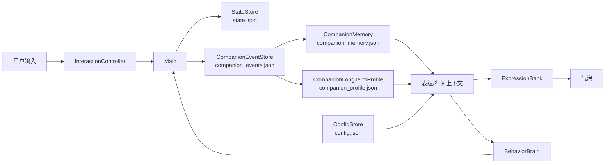

# 架构总览

MascotMate Desktop 由四层组成：

1. **Godot 运行层**：窗口、渲染、输入、物理、行为、表达、轻互动、截图贴图和本地状态。
2. **本地数据层**：`config.json`、`state.json`、陪伴事件、短期记忆、长期画像、截图历史和用户皮肤。
3. **工具与服务层**：资源生成、Godot 准备、皮肤导入、皮肤商店服务、陪伴控制台、AI sidecar、全局快捷键 helper。
4. **打包与系统集成层**：Linux portable bundle、desktop entry、hicolor 图标、可选 Godot export 和跨平台 zip。

## 运行时结构

```mermaid
flowchart TB
  Main["Main.gd<br/>生命周期 / 菜单 / 窗口同步"]
  Main --> Sprite["PetSprite.gd<br/>动作帧播放"]
  Main --> Physics["PetPhysics.gd<br/>窗口坐标物理"]
  Main --> Input["InteractionController.gd<br/>点击 / 长按 / 甩飞"]
  Main --> Mini["MiniGames.gd<br/>投喂 / 逗一逗"]
  Main --> Brain["BehaviorBrain.gd<br/>行为调度"]
  Brain --> Policy["CompanionBehaviorPolicy.gd<br/>规则 / 适配"]
  Main --> Resolver["CompanionExpressionResolver.gd<br/>intent 到执行"]
  Main --> Bank["CompanionExpressionBank.gd<br/>本地文案"]
  Main --> AIClient["CompanionAIExpressionClient.gd<br/>可选 AI 表达"]
  Main --> Events["CompanionEventStore.gd<br/>事件日志"]
  Main --> Memory["CompanionMemory.gd<br/>短期记忆"]
  Main --> Profile["CompanionLongTermProfile.gd<br/>长期画像"]
  Main --> Pins["ScreenshotPins.gd<br/>截图贴图"]
  Main --> Skins["SkinManager.gd<br/>皮肤"]

  Sprite --> SkinJson["skin.json / actions.json"]
  Pins --> Helper["pet_helper"]
  AIClient --> Sidecar["companion_ai_sidecar.py"]
  Skins --> Store["SkinStoreBridge.gd / skin_store_server.py"]
  Main --> Console["CompanionConsoleBridge.gd / companion_console"]
```

`Main.gd` 是编排中心。它创建模块、同步窗口大小、接收菜单命令、记录互动事件，并把行为 intent 执行为气泡、动作、特效、轻互动或捣乱演出。

## 数据流

核心原则：事件和画像可以影响表达选择、主动提示阈值和行为权重，但不能绕过忙碌判断，不能直接改核心状态，也不能让 AI 控制动作。

## 设计边界

- Godot 内保留桌宠运行逻辑，不承担离线素材转换。
- Python 脚本负责资源生成、导入、helper、本地 HTTP 服务和打包辅助。
- 所有运行时用户数据写入 `~/.config/mascotmate-desktop/`。
- 默认皮肤动作帧位于 `resource_hd/`，运行清单由脚本生成。
- 应用图标是独立资产：`godot_pet/assets/app_icon.png` 和 `packaging/icons/mascotmate-desktop.png`。
- Linux portable bundle 是默认可用打包路径；Godot export 是可选路径。

## 系统约束

透明窗口、鼠标穿透、置顶和全局快捷键依赖桌面环境。不同 X11/Wayland/macOS/Windows 环境的行为可能不同。

| 能力 | 主要依赖 | 备注 |
| --- | --- | --- |
| 透明背景 | Godot Window + 合成器 | `CRAYON_PET_SAFE_WINDOW=1` 可绕过 |
| 鼠标穿透 | `Window.mouse_passthrough_polygon` | 按可见区域生成，变化时才写入 |
| 置顶窗口 | 窗口管理器 | Wayland 限制更多 |
| 全局快捷键 | `pet_helper` / X11 / pynput | Wayland 下可能不可用 |
| 区域截图 | Godot `DisplayServer` + 平台工具 | Linux 可兜底 Spectacle/ImageMagick |
| 剪贴板图片 | 平台 helper | Linux 可用 `wl-copy` 或 `xclip` |

更细的陪伴系统设计见 [Companion Model v2](companion-model-v2.md)。
