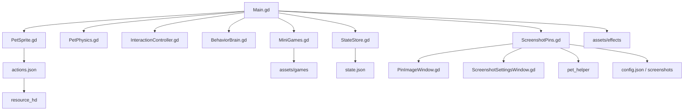

# 架构总览

项目由三层组成：

1. Godot 桌宠运行层：处理窗口、渲染、输入、物理、行为、轻互动和截图贴图。
2. 资源与构建脚本层：负责动作帧清单、高清资源生成、Godot runtime 准备、打包和桌面入口。
3. 系统集成层：依赖桌面窗口系统、跨平台 helper、截图/剪贴板后端和用户配置目录。

## 运行时结构

`Main.gd` 是编排中心。它创建其他模块、同步窗口大小、接收菜单命令，并在每帧把物理状态更新到 Godot 窗口位置。

## 设计边界

- Godot 内只保留桌宠运行逻辑，不把素材处理逻辑塞进 GDScript。
- Python 脚本只做离线生成或系统桥接，不承担桌宠 UI 主逻辑。
- 状态文件写入用户配置目录，不污染仓库。
- 运行时动作帧统一放在 `resource_hd/`，避免维护两份同名资源。
- Linux 打包先保证 portable bundle 可用，再提供 Godot export 的可选路径。

## 关键约束

透明窗口、鼠标穿透和全局快捷键不是纯应用层能力。不同桌面环境会影响最终表现：

| 能力 | 主要依赖 | 备注 |
| --- | --- | --- |
| 透明背景 | Godot Window + 合成器 | 安全窗口模式可绕过 |
| 鼠标穿透 | `Window.mouse_passthrough_polygon` | 用多边形控制可点击区域 |
| 置顶窗口 | 桌面环境窗口管理器 | 部分 Wayland 合成器限制更多 |
| 全局快捷键 | `pet_helper` / X11 `XGrabKey` / `pynput` | Wayland 下默认关闭，macOS 可能需要辅助功能权限 |
| 区域截图 | Godot `DisplayServer` | Linux 上保留 Spectacle 或 ImageMagick 兜底 |
