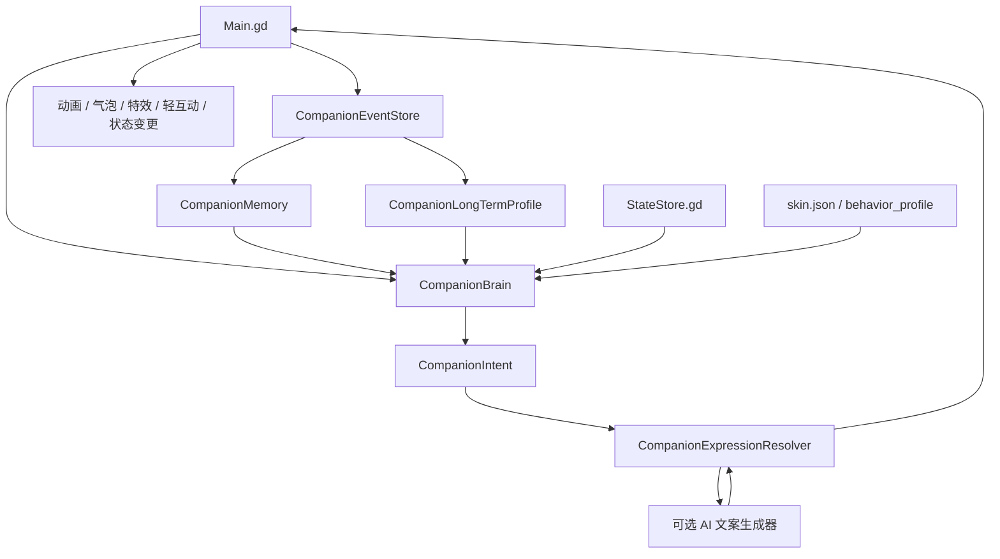

# Companion Model v2 设计文档

## 背景

当前陪伴系统已经具备本地状态、时间段、行为模式、互动冷却和皮肤行为权重：

- `StateStore.gd` 保存 `mood`、`hunger`、`energy`、`affection` 和最近互动记忆。
- `BehaviorBrain.gd` 根据模式、时间段、状态、忙碌状态和冷却输出行为请求。
- `Main.gd` 负责把输入、物理、动画、轻互动、气泡和行为请求编排到一起。
- `skin.json` 已支持 `capabilities` 和 `behavior_profile`，皮肤可以影响动作能力和活泼/捣乱权重。

v1 的主要问题不是“动作太少”，而是陪伴上下文太薄：

- 互动被压缩成 `kind`、最近时间和计数，缺少事件流。
- 行为脑直接选择动作，缺少“为什么做这个动作”的意图层。
- 气泡文案散落在 `Main.gd`，缺少统一语气、去重和上下文表达。
- 皮肤只影响动作与权重，还不能描述角色人格、偏好和表达风格。
- AI 能力如果直接接到动作层，会很难约束、测试和离线兜底。

v2 的目标是把当前规则系统升级成“本地优先、可解释、低打扰、可接 AI 的陪伴模型”。

## 当前实施状态

当前已完成本地陪伴闭环 v1：

- `CompanionEventStore.gd` 持久化最近 200 条用户互动和自动行为事件。
- `CompanionIntent.gd` 已提供统一 intent schema，`BehaviorBrain.decide()` 在原有 decision 字段外附带完整 `intent` 元数据。
- `CompanionBehaviorPolicy.gd` 已承接自动行为规则决策，`BehaviorBrain.gd` 保留调度、冷却记忆、事件记录和 legacy signal 兼容。
- `CompanionExpressionResolver.gd` 已把用户互动和自动行为 intent 统一解析为 bubble、action、capability、effect、mischief 和 state_delta。
- 自动 prompt、action、effect 会记录到 `companion_events.json`。
- `CompanionMemory.gd` 从事件日志聚合今日/近 3 天计数、偏好互动、常用模式/时段和关系熟悉度。
- `SkinManager.gd` 会为皮肤归一化可选 `personality`，缺失时使用默认人格。
- `CompanionExpressionBank.gd` 负责互动和自动提示气泡的本地表达选择，可读取记忆、人格 tone 和最近文案。
- 行为适配 v1 已让记忆和皮肤人格影响主动提示阈值、自动行为权重和非工作时段冷却，并在 decision 中附带 `adaptation` 元数据。
- 本地陪伴控制台 v1 已提供浏览器观测、行为适配开关/强度调参和固定场景回放；运行时会写入 `companion_debug_snapshot.json` 和 `companion_scenario_result.json` 供排查。
- `CompanionLongTermProfile.gd` 已持久化长期画像聚合结果，并温和影响主动提示阈值、自动行为权重和非工作时段冷却。
- AI 表达 sidecar 已完成可选接入和硬化：默认关闭，只生成气泡文案，支持扩展互动 key、运行期 TTL 缓存、health、provider 配置状态、最近表达来源统计、cache 命中和 fallback reason。
- AI 结构化记忆总结已作为独立开关接入：默认关闭，只接受受限 JSON 字段；通过本地校验后写入 `ai_summary`，并以 `effective_preferences` 温和影响长期画像。
- 自由聊天入口和 AI 主动陪伴仍是后续阶段。

## 设计原则

- 本地规则是主控，AI 只做可选增强。
- 所有自动行为都必须可解释、可冷却、可测试。
- 互动响应优先于主动打扰；用户主动做了事，桌宠应该及时回应。
- 角色人格、行为策略和表达语气跟皮肤绑定，但不能破坏全局安全边界。
- 数据先结构化，再考虑自然语言生成。
- 模型升级必须兼容现有 `state.json`、`behavior.json` 和 `skin.json`。

## 非目标

- 不在 v2 首期实现自由聊天窗口。
- 不让 LLM 直接控制窗口、鼠标、文件系统或系统命令。
- 不把全部行为改成黑盒概率模型。
- 不引入必须联网才能工作的核心体验。
- 不做复杂日程管理、任务管理或用户隐私采集。

## 总体架构



推荐增量落地，而不是一次性替换：

- `StateStore.gd` 保留四维核心数值。
- `BehaviorBrain.gd` 先演进为 v2 决策入口，内部逐步拆出子模块。
- `Main.gd` 继续作为运行时编排中心，但不再散落大量陪伴文案。
- 事件日志和表达库先用 Godot 本地 JSON 文件实现。
- AI sidecar 是当前可选模块，默认关闭；没有 sidecar、超时或返回不合规时继续使用本地表达。

## 核心概念

### Companion Event

事件是陪伴模型的事实来源。用户互动、自动行为、提示、模式切换、状态变化都应记录成事件。

示例：

```json
{
  "version": 1,
  "id": "evt_1761998400_0001",
  "at": 1761998400,
  "source": "user",
  "kind": "feed_success",
  "period": "entertainment",
  "mode": "活泼",
  "skin_id": "classic_shinchan",
  "state_before": {
    "mood": 70,
    "hunger": 84,
    "energy": 70,
    "affection": 30
  },
  "state_after": {
    "mood": 75,
    "hunger": 59,
    "energy": 70,
    "affection": 33
  },
  "tags": ["care", "food", "positive"],
  "meta": {
    "interaction": "feed",
    "result": "success"
  }
}
```

首期事件种类：

| kind | 来源 | 说明 |
| --- | --- | --- |
| `pet_head` | user | 单击头部摸摸头 |
| `poke_body` | user | 单击身体戳一戳 |
| `grab_start` | user | 抱起开始 |
| `release_soft` | user | 轻放 |
| `throw_fast` | user | 甩飞 |
| `peek_enter` | user | 拖到边缘偷看 |
| `peek_exit` | user | 从偷看状态回来 |
| `feed_start` | user | 打开投喂 |
| `feed_success` | user | 投喂成功 |
| `tease_start` | user | 开始逗一逗 |
| `tease_success` | user | 逗一逗命中 |
| `mode_changed` | user | 行为模式切换 |
| `auto_action` | system | 自动动作执行 |
| `auto_prompt` | system | 自动提示 |
| `auto_effect` | system | 自动特效 |
| `sleep_tick` | system | 睡眠恢复 |
| `passive_decay` | system | 被动状态衰减 |

### Companion Memory

记忆分三层：

| 层级 | 生命周期 | 用途 |
| --- | --- | --- |
| session memory | 当前启动会话 | 防止短时间重复回应，保存刚发生的事件 |
| short-term memory | 最近 1-3 天 | 识别今天互动、最近模式、最近偏好 |
| long-term profile | 长期累积 | 用户偏好、角色关系、互动习惯 |

当前 Memory v1 存储在独立的 `companion_memory.json`，由最近 200 条事件重新聚合：

```json
{
  "version": 1,
  "updated_at": 1761998400,
  "daily": {
    "date": "2026-07-04",
    "counts": {
      "feed_success": 1,
      "tease_success": 3
    },
    "last_event_at": 1761998400
  },
  "short_term": {
    "days": 3,
    "counts": {},
    "mode_counts": {},
    "period_counts": {},
    "recent_kinds": [],
    "last_event_kind": "tease_success"
  },
  "preferences": {
    "favorite_interactions": [],
    "favorite_mode": "活泼",
    "favorite_period": "entertainment"
  },
  "relationship": {
    "level": "familiar",
    "familiarity": 33,
    "care_score": 10,
    "play_score": 10
  },
  "dialogue": {
    "recent_lines": [],
    "last_intent_at": {}
  }
}
```

`StateStore.gd` 的四维核心数值仍保留在 `state.json`。Memory v1 会为表达层和行为适配层提供上下文；行为适配只调整主动提示阈值、自动行为权重和冷却，不改变核心状态数值。

### Companion Intent

意图是行为脑的语义输出。v2 不应该直接从状态跳到 `walk` 或 `bubble`，而是先产生 intent。

示例：

```json
{
  "type": "care_request",
  "name": "hungry",
  "priority": 80,
  "reason": "hunger >= 80 and last_feed_at older than 2h",
  "cooldown_key": "prompt:hungry",
  "interruption_level": "low",
  "suggested_expression": "auto_prompt:hungry",
  "state_delta": {},
  "constraints": {
    "allow_bubble": true,
    "allow_action": false,
    "allow_effect": true
  }
}
```

首期意图表：

| type | name | 触发依据 | 默认表达 |
| --- | --- | --- | --- |
| `care_request` | `hungry` | 饥饿高、投喂间隔足够久 | 气泡 + note |
| `rest_request` | `sleepy` | 体力低或休息时段 | 睡觉动作 |
| `play_request` | `low_mood` | 心情低且娱乐时段 | 邀请玩 |
| `social_response` | `pet_head` | 用户摸头 | 气泡 + 爱心 |
| `social_response` | `feed_success` | 投喂成功 | 吃饭动作 + 气泡 |
| `social_response` | `tease_success` | 逗一逗成功 | playful 动作 + 爱心 |
| `ambient` | `walk` | 活泼模式、冷却结束 | 散步 |
| `ambient` | `companion_pose` | 活泼模式、状态稳定 | companion 动作 |
| `ambient` | `edge_peek` | 活泼模式、娱乐时段 | 贴边走 |
| `ambient` | `footprint` | 活泼模式、轻特效权重 | 脚印 |
| `mischief` | `grab_mouse` | 捣乱模式、冷却结束 | 抢鼠标演出 |

### Companion Expression

表达是 intent 到运行时动作的翻译结果。

Expression Bank v1 已覆盖用户互动和自动提示气泡。它不读取外部 JSON，也不改变动作、状态数值或行为权重；没有匹配表达时会使用调用方传入的原始文案作为 fallback。当前实现会读取 `CompanionMemory` 的关系熟悉度、偏好互动、最近表达，以及运行时 `app.dialogue_tone` 覆盖后的 `tone`，用于选择上下文候选文案。

示例：

```json
{
  "intent": "care_request:hungry",
  "bubble": {
    "key": "auto_prompt:hungry",
    "text": "我有点饿了，要不要补点能量？",
    "seconds": 2.4
  },
  "action": "",
  "capability": "",
  "effect": "note",
  "state_delta": {},
  "record": {
    "kind": "auto_prompt",
    "tags": ["care", "food"]
  }
}
```

表达可以包含：

- `bubble`：气泡文案。
- `action`：具体动作名，例如 `walk`、`sleep`。
- `capability`：皮肤能力，例如 `companion`、`feeding`、`playful`。
- `effect`：轻特效，例如 `heart`、`note`、`footprint`。
- `mini_game`：轻互动入口，例如 `feed`、`tease`。
- `state_delta`：状态变化。
- `record`：执行后写入事件日志的信息。

## 决策管线

每次 tick 或用户互动后，按以下顺序处理：

1. 收集上下文：模式、忙碌状态、物理状态、轻互动状态、皮肤、核心状态、最近事件、时间段。
2. 应用被动状态变化：饥饿、体力、心情等。
3. 将用户互动转换为事件，并优先生成回应型 intent。
4. 若当前忙碌，只允许低成本回应：气泡、状态记录、短特效；不切换物理动作。
5. 检查紧急需求：饥饿、低体力、低心情。
6. 检查打扰冷却：按 mode、period、intent 类型和最近用户互动决定。
7. 应用皮肤人格和行为偏好。
8. 产生一个或零个 intent。
9. 将 intent 解析为 expression。
10. 由 `Main.gd` 执行 expression，并记录结果事件。

用户互动回应不应被普通主动打扰冷却完全吞掉。可以使用独立的短回应冷却，例如：

| 冷却类型 | 用途 | 建议 |
| --- | --- | --- |
| `attention_cooldown` | 自动主动行为 | 保留现有长冷却 |
| `response_cooldown` | 用户互动回应 | 0.8-2 秒 |
| `line_repeat_cooldown` | 同一句气泡去重 | 5-30 分钟 |
| `intent_cooldown` | 同类意图去重 | 按 intent 配置 |

## 时间段模型

v1 用 `work`、`entertainment`、`rest` 三段即可继续保留。v2 应把时间段计算封装成独立 helper，避免散落在行为脑中。

推荐输出：

```json
{
  "period": "entertainment",
  "hour": 20,
  "weekday": 6,
  "is_workday": false,
  "source": "system_local_time"
}
```

注意：时间段必须按用户本地时间理解。实现时要明确 Godot 时间 API 的本地/UTC 行为，并用固定时间测试覆盖工作时段、娱乐时段和休息时段。

## 皮肤人格扩展

在 `skin.json` 或 `behavior_profile` 中新增可选字段：

```json
{
  "personality": {
    "version": 1,
    "archetype": "playful",
    "tone": "short_cute",
    "traits": {
      "playfulness": 80,
      "mischief": 45,
      "patience": 65,
      "clinginess": 40
    },
    "favorite_intents": ["play_request:low_mood", "ambient:companion_pose"],
    "dialogue_style": {
      "max_chars": 28,
      "use_status_numbers": false,
      "avoid_repeating_recent": true
    }
  }
}
```

当前实现会归一化人格字段，并只让它影响文案和表达风格。后续如果让人格影响权重，也不允许绕过全局安全约束：

- 不能缩短到低于全局下限的打扰冷却。
- 不能在忙碌状态强行打断用户操作。
- 不能让普通皮肤开启系统级能力。
- 不能直接写入任意路径。

## 文案与表达库

当前 `CompanionExpressionBank.gd` 先使用 GDScript 内置候选表，支持 `tones`、`relationship_levels`、`favorite_interactions`、`modes`、`periods` 条件。后续如果资源化，可以迁移为等价 JSON，例如：

```json
{
  "version": 1,
  "lines": {
    "auto_prompt:hungry": [
      {
        "text": "我有点饿了，要不要补点能量？",
        "conditions": {
          "hunger_min": 80
        },
        "weight": 1.0
      },
      {
        "text": "想吃一点，谢谢你记得我。",
        "conditions": {
          "affection_min": 45
        },
        "weight": 0.8
      }
    ],
    "pet_head": [
      {
        "text": "摸摸头，辛苦啦。",
        "weight": 1.0
      },
      {
        "text": "多摸一会儿也可以。",
        "conditions": {
          "affection_min": 60
        },
        "weight": 0.6
      }
    ]
  }
}
```

选择文案时按以下顺序过滤：

1. intent key 匹配。
2. 状态条件匹配。
3. 时间段和模式匹配。
4. 皮肤 tone 匹配。
5. 最近说过的台词降权或排除。
6. 权重抽样。

## AI 接入边界

AI 作为可选表达生成器，不参与动作、状态或行为权重。

当前 sidecar 由 `pet_helper.py companion-ai-sidecar` 启动，只监听 `127.0.0.1`。默认 provider 为 `local_stub`；`openai_compatible` 的 endpoint、API key 和 model 只从环境变量读取，不写入 `config.json`。

推荐协议：

```json
{
  "request": {
    "intent": {
      "type": "social_response",
      "name": "feed_success"
    },
    "state": {
      "mood": 75,
      "hunger": 59,
      "energy": 70,
      "affection": 33
    },
    "memory": {},
    "profile": {},
    "personality": {
      "tone": "short_cute",
      "max_chars": 28
    }
  },
  "response_schema": {
    "text": "string",
    "emotion": "string",
    "safety": "ok|fallback"
  }
}
```

运行时必须校验 AI 返回：

- 文案长度。
- 是否为空。
- 是否包含不适合气泡的换行或控制字符。
- 是否超出当前 intent 范围。
- 超时、失败或不合规时回退本地文案。

AI 不返回动作命令。动作仍由本地 expression resolver 决定。当前表达实现只接受 `text`、`seconds`、`emotion`、`safety` 四个响应字段；未知字段、超长文本、空文本、超时、HTTP 错误、坏 JSON 或 `safety != "ok"` 都回退本地表达。控制台快照会记录 sidecar health、provider configured 状态、最近 10 次表达来源统计、cache 命中和 fallback reason。

结构化记忆总结使用 `/v1/memory-summary`，只接受 `favorite_interactions`、`favorite_mode`、`favorite_period`、`care_tendency`、`play_tendency`、`interruption_tolerance`、`confidence` 和 `safety`。`confidence < 60`、未知字段、非法枚举或 `safety != "ok"` 都不会写入长期画像。

## 文件与模块建议

首期可以保持 GDScript 模块简单：

| 文件 | 职责 |
| --- | --- |
| `CompanionEventStore.gd` | 事件写入、环形裁剪、近期查询 |
| `CompanionMemory.gd` | 从事件和状态生成短期/长期摘要 |
| `CompanionLongTermProfile.gd` | 保存长期画像聚合结果 |
| `CompanionIntent.gd` | intent 常量、校验和工具函数 |
| `CompanionBehaviorPolicy.gd` | 本地行为规则、适配、冷却和权重决策 |
| `CompanionExpressionResolver.gd` | intent 到运行时 expression 的解析 |
| `CompanionExpressionBank.gd` | 本地文案和 expression 选择 |
| `CompanionAIExpressionClient.gd` | 可选 AI 文案和结构化记忆总结请求、校验、缓存和回退 |
| `BehaviorBrain.gd` | 行为调度、legacy signal 兼容、自动事件记录 |

持久化路径建议：

```text
~/.config/mascotmate-desktop/state.json
~/.config/mascotmate-desktop/companion_events.json
~/.config/mascotmate-desktop/companion_memory.json
~/.config/mascotmate-desktop/companion_profile.json
```

事件日志需要上限：

- 默认最多保存 200 条近期事件。
- 每次写入后裁剪。
- 长期偏好只保存聚合结果，不保存大量原始细节。

## 迁移策略

### 第一步：事件日志

- 新增事件存储。
- `Main.gd` 中所有 `_record_interaction()` 入口同步写入事件。
- 自动 prompt、action、effect 执行后写入事件。
- 不改变当前行为结果。

验收标准：

- 现有 smoke test 不变。
- 投喂、摸头、戳、抱起、甩飞、偷看、自动提示都有事件。
- 事件文件不存在或损坏时自动重建，不影响启动。

### 第二步：表达库

- 把 `Main.gd` 中固定气泡迁移到表达库。
- 保留同样文本作为默认输出。
- 加入最近文案去重。

验收标准：

- 用户可见行为基本不变。
- 同类高频互动不会连续重复同一句。
- 所有文案都能从 key 追踪到 intent 或 event。

### 第三步：意图层

- `BehaviorBrain.decide()` 改为先生成 intent，再转成原有 decision。
- 保持 `action_requested`、`prompt_requested`、`effect_requested` 等信号兼容。
- 给 decision 增加 `reason` 字段，测试可断言。

验收标准：

- 饥饿、低体力、低心情、活泼散步、脚印、捣乱首轮都能解释原因。
- 忙碌状态下不打断物理和轻互动。

### 第四步：皮肤人格与行为适配

- `SkinManager.gd` 合并 `personality` 默认值。
- `CompanionExpressionBank` 按 tone、熟悉度和偏好选择文案。
- `BehaviorBrain.gd` 按人格 traits 和记忆偏好调整主动提示阈值、intent 权重和非工作时段冷却。

验收标准：

- 缺少人格字段的旧皮肤完全兼容。
- 不同皮肤可以改变表达语气和自动行为倾向，但不能绕过忙碌、暂停、工作时段和休息时段限制。

### 第五步：AI 表达增强

- Python sidecar 或本地 HTTP helper 接收结构化 request。
- Godot 设置超时和本地回退。
- 首期只允许生成 bubble 文案。
- 默认关闭，可离线运行；控制台展示 AI 状态和最近表达来源。

验收标准：

- 断网或 sidecar 未启动时体验不降级。
- AI 返回不合规时使用本地表达库。
- 所有 AI 输出都受长度、字符和 intent 范围限制。

### 第六步：长期行为画像适配与 AI 硬化

- `BehaviorBrain.gd` 读取长期画像的照料倾向、陪玩倾向、打扰容忍度、常用模式和常用时段。
- 长期画像只做温和修正：影响提示阈值、权重倍率和非工作时段冷却，不新增行为类型。
- 低打扰画像会拉长主动冷却并降低邀请、脚印、贴边和捣乱倾向；高陪玩画像提高 invite/陪玩提示倾向；高照料画像略降低饥饿提示阈值。
- 工作时段、休息时段、忙碌状态、暂停状态和安静模式仍是硬边界。
- 控制台场景回放新增低打扰用户、高陪玩用户、高照料用户、工作时段长期偏好保护和休息时段保护。
- sidecar `/health`、上游 HTTP 错误、坏 JSON、非 JSON、非法 schema 和超长输出都有稳定 fallback。

## 测试策略

### 单元和 smoke 覆盖

需要新增或扩展：

- 事件存储读写、裁剪、损坏恢复。
- 记忆聚合、损坏恢复和最近表达记录。
- v2 状态迁移。
- intent 生成原因。
- adaptation 阈值、权重、冷却和边界约束。
- 长期画像对阈值、权重、冷却的温和适配，以及工作/休息/忙碌边界保护。
- expression 文案选择、上下文候选和去重。
- 皮肤人格缺省合并。
- AI health、超时、坏 JSON、非法 schema、超长输出和回退统计。

### 固定场景测试

建议维护一组固定上下文：

| 场景 | 输入 | 期望 |
| --- | --- | --- |
| 高饥饿 | hunger 84，非休息时段 | `care_request:hungry` |
| 低体力 | energy 18 | `rest_request:sleepy` |
| 娱乐低心情 | mood 30，娱乐时段 | `play_request:low_mood` |
| 工作时段 | work，活泼模式 | 主动行为降权或延后 |
| 忙碌状态 | grabbing / tease / mischief | 不切换物理动作 |
| 刚摸头 | `pet_head` 事件 | 即时回应，不触发长冷却 |
| 重复提示 | 最近说过同一句 | 换句或静默 |
| 长期低打扰 | `interruption_tolerance=low` | 拉长主动冷却，不绕过边界 |
| 长期高陪玩 | `play_tendency` 高 | 娱乐时段更容易触发陪玩提示 |
| 长期高照料 | `care_tendency` 高 | 饥饿提示阈值温和下降 |

### 可解释性测试

每个自动 intent 都应包含：

- `reason`
- `cooldown_key`
- `priority`
- `interruption_level`
- `source`

这样后续调参不会变成只看体感。

## 兼容性

- 旧 `state.json` 继续只承载核心状态和旧 memory 字段，不迁移到嵌套 `companion` 命名空间。
- `companion_memory.json` 可由事件日志重建，损坏时丢弃并重新聚合。
- 旧 `behavior.json` 继续有效。
- 旧 `skin.json` 缺少 `personality` 时使用默认人格。
- 旧信号保留，新增 v2 intent 可以先只在内部使用。
- 事件和记忆文件损坏时丢弃并重建，不阻断桌宠启动。

## 风险与约束

| 风险 | 对策 |
| --- | --- |
| 行为变得过度主动 | 全局冷却、工作时段倍率、打扰等级 |
| 状态文件复杂度上升 | 核心状态留在 `state.json`，陪伴记忆放入独立 `companion_memory.json` |
| 文案膨胀难维护 | 表达库按 intent key 管理，测试覆盖 key 存在性 |
| AI 输出不可控 | AI 只生成文案，本地校验和回退 |
| 调参不可解释 | intent 必带 reason 和 priority |
| 皮肤配置破坏行为 | 校验 personality 和 behavior_profile，应用全局下限 |

## 推荐实现顺序

不按日期排期，按依赖推进：

1. 已完成 `CompanionEventStore`：系统知道发生过什么。
2. 已完成表达库：文案从 `Main.gd` 抽出，建立 key 和去重。
3. 已完成 intent 层：行为决策有语义和原因。
4. 已完成本地陪伴闭环 v1：从事件中聚合记忆，结合皮肤人格选择表达。
5. 已完成行为适配 v1：让记忆和人格在全局冷却约束内影响提示阈值、自动行为权重和冷却。
6. 已完成长期画像 + AI 表达增强 v1：长期画像进入表达上下文，AI 只增强文案、不接管行为。
7. 已完成长期行为画像适配 + AI 接入硬化 v1：长期画像温和影响行为倾向，AI health、fallback reason 和表达来源统计进入控制台。
8. 后续自由聊天或 AI 主动陪伴：需要单独规划权限、隐私、交互入口和更严格的安全边界。

这一顺序的好处是每一步都能单独验收，并且不会要求一次性重写运行时。
