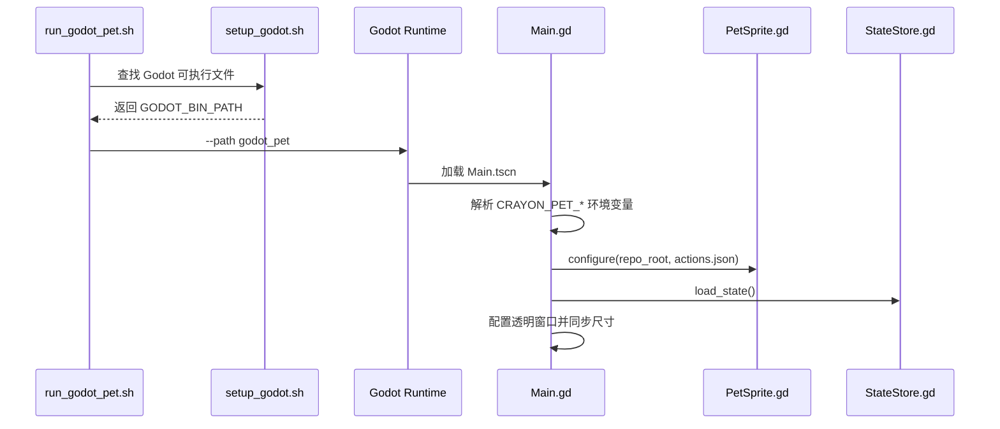
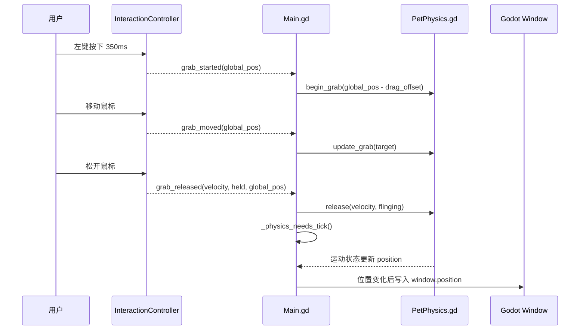
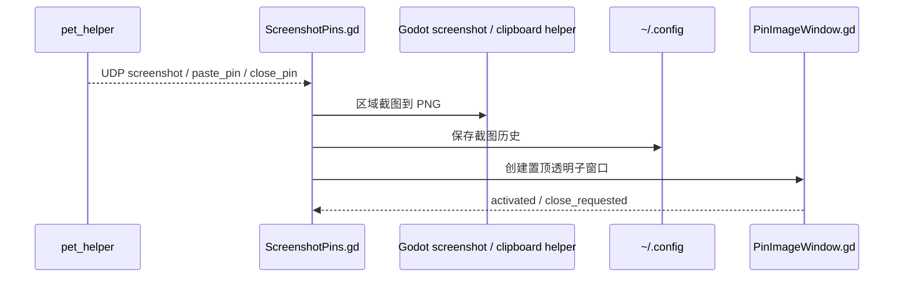

# 数据流

## 启动流程



## 交互到物理

长按抱起和释放甩飞的链路：



空闲或不需要物理推进的状态不会每帧调用 `PetPhysics.tick()`，窗口位置也会先比较再写入。这样保持窗口坐标即物理坐标的模型，同时降低空闲 CPU 和窗口系统调用。

## 资源加载

`PetSprite.gd` 不直接扫描目录。它读取 `actions.json` 中的动作定义，并从统一资源目录加载：

```text
resource_hd/<relative_path>
```

如果暂时只有较低清晰度的素材，也直接放入 `resource_hd/` 对应动作目录，后续替换同名文件即可。

## 截图贴图链路



贴图窗口本身由 Godot `Window` 实现。图片会按屏幕尺寸做最大尺寸限制，避免贴图大到超出屏幕。

## 状态数据

角色状态以四个核心数值为主，并附带互动记忆：

| 字段 | 含义 | 范围 |
| --- | --- | --- |
| `mood` | 心情 | 0-100 |
| `hunger` | 饥饿 | 0-100 |
| `energy` | 体力 | 0-100 |
| `affection` | 亲密度 | 0-100 |

`StateStore.gd` 还保存 `last_decay_at` 和 `memory`，用于被动衰减、最近互动、投喂、提示和自动行为冷却。保存采用短 debounce，并在退出时 flush。行为模式不保存，每次启动默认回到安静模式。
